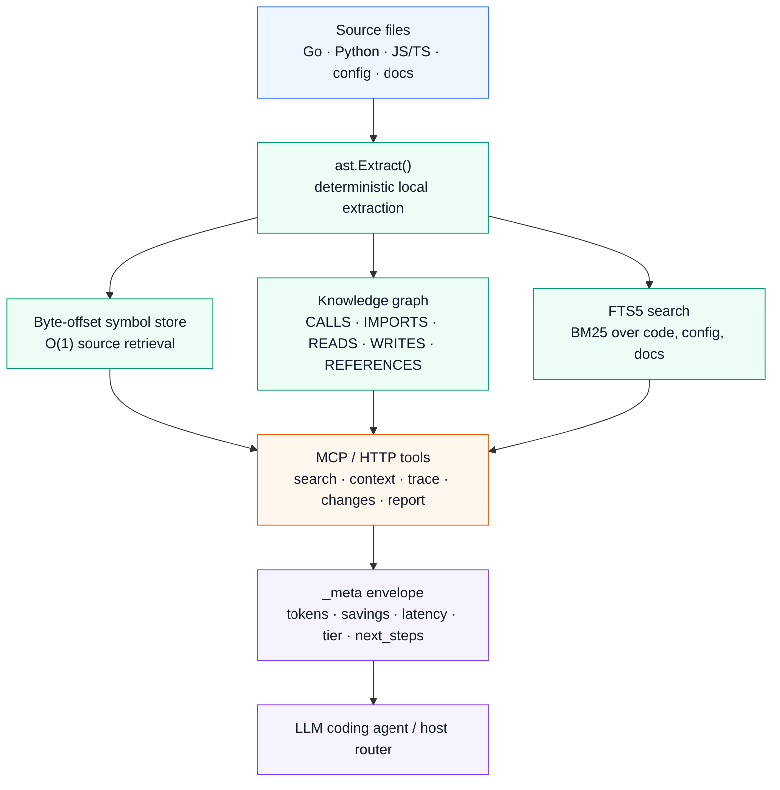
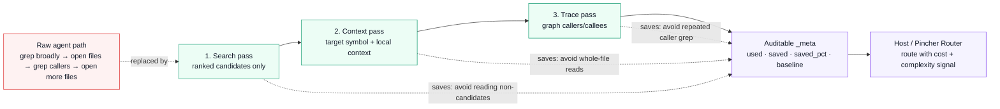

<div align="center">
  
</div>

<div align="center">

[](https://github.com/kwad77/pincher/actions/workflows/ci.yml)
[](https://golang.org)
[](LICENSE)
[](docs/reference/)

**Local graph intelligence for LLM coding agents.**
Stop paying agents to rediscover the same codebase with raw file reads.

Pincher's core value is auditable token reduction: search → context → trace replaces broad grep/read loops with compact source-grounded graph evidence, and every call reports `_meta.tokens_used`, `_meta.tokens_saved`, `tokens_saved_pct`, and `baseline_method`.

Single binary · Local index · MCP stdio · HTTP REST · OpenAPI 3.1

[Quick start](#quick-start) · [Why Pincher exists](#why-pincher-exists) · [Agent loop](#the-agent-loop) · [Savings](#savings-you-can-audit) · [Reference](docs/reference/) · [Tutorials](docs/tutorials/)

</div>

---

## Why Pincher exists

LLM coding agents are good at reasoning once they have the right context. They are bad at obtaining that context cheaply.

The default loop is expensive and noisy:

1. Search broadly.
2. Open whole files.
3. Guess which function matters.
4. Open more files to find callers.
5. Repeat after every context reset.

Pincher replaces that loop with source-grounded graph calls. An agent asks for the exact symbol, the direct context around it, the callers, or the blast radius of a diff. Pincher returns compact evidence with file, line, confidence, token accounting, and suggested next calls.

That matters because the output is not just smaller. It is routeable. Every tool response carries `_meta`: token counts, baseline method, savings, latency, warnings, capabilities, and `complexity_tier`. A host or Pincher Router can use that signal to decide whether the next step belongs on a fast cheap model, a stronger coding model, or a local long-running lane.

Pincher is not a search UI with an MCP wrapper. It is local code-navigation infrastructure for agent edit loops.

---

## Quick start

```bash
# 1. Install one binary.
go install github.com/kwad77/pincher/cmd/pinch@latest
# Or download a release binary:
# https://github.com/kwad77/pincher/releases/latest

# 2. Add Pincher's usage policy to your agent client.
pincher init --target=detect
# Explicit targets include claude, cursor, codex, zed, jetbrains, vscode,
# and goose (project-scoped Goose Open Plugins hook extension).

# 3. Index a project.
pincher index /path/to/project

# 4. Run the MCP/HTTP server.
pincher supervised
# or, for the browser dashboard + HTTP API:
pincher web
```

Minimal Claude Code MCP config:

```json
{
  "mcpServers": {
    "pincher": {
      "type": "stdio",
      "command": "/path/to/pincher",
      "args": ["supervised"]
    }
  }
}
```

`supervised` keeps the provider stable across crashes and binary upgrades. You can rebuild Pincher and the next tool call restarts the inner server instead of forcing a manual MCP reconnect.

Host walkthroughs: [Claude Code](docs/tutorials/claude-code.md), [Cursor](docs/tutorials/cursor.md), [VS Code Copilot Chat](docs/tutorials/vscode-copilot.md), [Codex](docs/tutorials/codex.md), [JetBrains](docs/tutorials/jetbrains.md), [Zed](docs/tutorials/zed.md), [Goose](docs/tutorials/goose.md), and the [HTTP dashboard](docs/tutorials/http-dashboard.md). Goose needs two pieces: add Pincher as a stdio MCP extension in `~/.config/goose/config.yaml`, then run `pincher init --target=goose` to write the project-scoped `.agents/plugins/pincher/` Open Plugins hook extension that routes `developer__shell|developer__text_editor` hook events through `pincher hook-check`. Managed installs live in [`packaging/README.md`](packaging/README.md).

---

## The agent loop

Pincher gives agents a small set of high-leverage moves:

| Agent question | Pincher call | What comes back |
|---|---|---|
| "Where is this thing?" | `search` | Ranked symbols from code/config/docs corpora, with IDs and confidence. |
| "What does this function need around it?" | `context` | The symbol source plus direct callees/import context. |
| "Who breaks if I change this?" | `trace` | Caller/callee paths with depth and risk labels. |
| "What did my diff touch?" | `changes` | Changed symbols, impacted callers, and tests to run. |
| "Orient me in this repo." | `architecture`, `onboard_module`, `context_for_task` | Entry points, hotspots, graph stats, module boundaries, and recent-change overlap. |
| "What should I do next?" | `guide`, `_meta.next_steps` | Recommended follow-up Pincher calls, not a generic checklist. |

Example shape:

```json
{
  "name": "processPayment",
  "file_path": "internal/payments/service.go",
  "start_line": 84,
  "source": "func processPayment(amount float64) error { ... }",
  "_meta": {
    "tokens_used": 312,
    "tokens_saved": 14500,
    "tokens_saved_pct": 97.9,
    "baseline_method": "full_file_read",
    "complexity_tier": "lite",
    "latency_ms": 2,
    "next_steps": [
      { "tool": "trace", "why": "check inbound callers before changing behavior" }
    ]
  }
}
```

The important part is the envelope. Pincher does not merely answer the immediate lookup. It leaves behind evidence a router can learn from.

---

## What Pincher indexes

One Go binary builds three layers from one extraction pass:



Current Pincher dogfood index for this repo reports:

- 886 files
- 8,358 symbols
- 15,867 graph edges
- node kinds including functions, methods, modules, sections, settings, and rationale nodes
- edge kinds including `CALLS`, `IMPORTS`, `READS`, `WRITES`, and `REFERENCES`

The index stays current through a per-project watcher. It content-hashes files, re-extracts changed files, and records schema/binary freshness so stale results are visible instead of silently trusted.

Pincher supports MCP stdio and HTTP REST. The HTTP gateway exposes the same tools at `/v1/<tool>` plus OpenAPI 3.1 contracts, dashboard routes, health probes, and request IDs for tracing.

---

## Savings you can audit

Pincher savings are token math, not vibes. The reason to use the product is that the normal agent discovery loop burns context on files it did not need to read. Pincher makes the high-value loop explicit:



1. **Search pass — spend tokens only on candidates.** `search` turns a broad grep/read sweep into ranked symbol, config, and docs rows. The agent sees IDs, file paths, snippets, and confidence before deciding whether any source body is worth reading.
2. **Context pass — read the right slice, not the whole file.** `context` returns the selected symbol plus directly relevant callees/import context. It replaces opening entire files just to understand one function or method.
3. **Trace pass — follow graph edges instead of guessing callers.** `trace` walks caller/callee paths with depth and risk labels. It replaces repeated grep/read loops across possible callsites before a behavior or signature change.

Every pass leaves falsifiable accounting in `_meta`:

- `tokens_used`: what Pincher returned
- `tokens_saved`: estimated tokens avoided versus the baseline
- `tokens_saved_pct`: saved / baseline
- `baseline_method`: for example `full_file_read`
- `latency_ms`: measured server-side latency

The baseline is explicit. For source-oriented tools, `full_file_read` means the bytes of the files Pincher referenced — the rough cost of the raw agent path — compared with the compact Pincher response. Other tools use `index_summary` or `none` when there is no honest file-read substitute.

The ceiling depends on the workflow:

| Workflow | Typical outcome |
|---|---|
| Search pass: `search` | Cuts broad discovery down to ranked symbol rows before the agent reads source. |
| Context pass: `symbol`, `symbols`, `context` on large files | Often 90-99% fewer tokens than opening whole files. |
| Trace pass: `trace`, plus `changes` / `context_for_task` | Replaces multi-step grep/read/caller discovery loops. |
| Orientation: `architecture`, `health`, `report` | Gives repo-level evidence without dumping the tree or hand-reading docs. |

Aggregate sessions on large Go/JS projects usually land around 70-90% token reduction. Smaller repos and stub-tier languages can be closer to break-even. Pincher exposes the raw numbers so you can check the claim for your own project.

For reproducibility, see [`scripts/reproduce-savings.sh`](scripts/reproduce-savings.sh), [`docs/methodology/token-savings.md`](docs/methodology/token-savings.md), [`docs/reference/tools.md`](docs/reference/tools.md), and the dashboard at `/v1/dashboard`.

---

## Why this is different from normal code search

Normal search helps a human browse. Pincher helps an agent decide.

- It returns symbol IDs that can be reused across calls.
- It reads source by byte offset instead of reparsing or opening whole files.
- It traverses graph edges instead of hoping text search finds callers.
- It projects fields so the agent can ask for only `id,name,file_path` before reading source.
- It reports empty-result reasons, confidence, stale-index state, and suggested recovery steps.
- It accumulates savings and call evidence across sessions, which makes routing measurable.

The result is an edit loop with fewer blind reads and better handoffs after context resets.

---

## Where Pincher is now (v1.8)

Pincher v1.0 froze the core tool/schema surface; everything since has been additive. v1.2 shipped Pincher-native graph intelligence (`pincher report`, rationale symbols, hotspot risk scoring). v1.3 landed the substrate (edge provenance tiers, MCP progress + prompts). v1.4 was the **loop release** — the agent-loop substrate plus the ADR-0008 AST-tier language wave (tree-sitter via WASM: Rust, Java, C#, TS/TSX, Swift, Kotlin, PHP, Ruby, C++ at confidence 1.0). v1.5 made the loop **measure itself** (LES, pointer handoffs, the PreCompact hook, loopbench). v1.6 shipped the **schema diet, measured at scale** (core/lean `tools/list` by default, 1.44M vs 475k total tokens at 10x scale at identical accuracy). v1.7 made pincher **routing-ready** — 5.0× faster fresh indexing (2,177s → 437s at k8s scale), the startup detection ladder gating the conditional `models`/`route` proxy surface, the index-recruiting hook, and `init --router` seeding (full guide: [docs/reference/routing.md](docs/reference/routing.md)). v1.8 is the **routing GA-candidate** — it closes the loop around that surface:

- **The recruitment advisory** — a session spawning its third subagent on a machine with a detected router gets exactly one non-blocking PreToolUse hint naming the `route` tool and the dispatch verse; `continue: true` on every branch, no network in the hook path, take-rate instrumented rather than asserted.
- **The outcome auto-echo** — the route proxy caches every consult it forwards (bounded LRU) and auto-completes the dispatch verse's minimal outcome card `{request_id, outcome_class, gate}` to the router's full OutcomeBody echo. Explicit caller fields always win; cache misses pass through unchanged so router rejections surface honestly.
- **The dashboard Models tab** — `pincher web` renders the router's worker registry read-only (kind, tier, enabled provenance, raw cost spec, `last_seen` freshness, declared/discovered source) only when a live router was detected at startup; no router ⇒ no tab, no fetch, byte-identical HTML. Nothing in pincher can enable a paid worker — the router owns all registry state.
- **The guide/coach adoption loop** — `guide` appends a `route` consult to Make-shaped recommendations (stage policy keeps every other shape unrouted); `coach` reports route-consult coverage, the session consult/outcome split, and a counts-only unrouted-spawns finding (estimated savings deliberately 0 — routing savings are recorded router-side, never invented). Router absent ⇒ both responses byte-identical to the pre-routing surface.
- **GA status, honestly held** — the program's ship gate (≥30 routed Make-stage task units: sub-tier routing share, S5 pass-rate parity, $/iteration delta) is **measurement in progress**; the [v1.8.0 what's-new](docs/launch/v1.8.0-whats-new.md) carries explicit `[GATE]` slots instead of unmeasured claims.

The boundary is deliberate: no default LLM extraction pipeline, no dashboard-first claims without API/report provenance, and no unsupported savings multipliers. If a report names a symbol or file, it should come with source provenance or say the data is missing.

---

## Tool surface

Pincher currently exposes 36 MCP tools (10 advertised over `tools/list` by default — 12 when a live pincher-router is detected, which adds `models` + `route`; see the schema-diet note below. All 36 stay reachable over HTTP, and the read-only query set as `batch` sub-queries). The high-frequency set:

- `guide` — choose the next Pincher call from a task description
- `search` — BM25 symbol/config/docs search
- `symbol` / `symbols` — O(1) source retrieval by stable symbol ID
- `context` — symbol plus direct callable context
- `trace` — caller/callee graph traversal with risk labels
- `changes` — git diff to impacted symbols and tests to run
- `context_for_task` — composite search/context/trace/changes starter
- `architecture` — entry points, hotspots, graph stats, surprising connections
- `health` / `doctor` / `schema` / `stats` — freshness, coverage, diagnostics, savings

The CLI also includes `pincher report`, a source-grounded architecture report artifact built from the same index.

**Schema diet (#2003, default since v1.6):** the full `tools/list` advertisement weighs ~18.5k approx tokens, re-read by the host every turn. By default pincher now advertises the 11 loop-essential tools (including the `adr` decision store, added in #2020) with lean first-sentence descriptions (combined core+lean ~3.2k, gate-tested under 4k — ~3.7k with the router pair detected) while keeping every tool reachable over HTTP `/v1/<tool>` and the read-only query set as `batch` sub-queries. The flip is measured (PR #2005, 10x-scale loopbench): full/rich burned 1.44M total tokens vs 475k for core+lean at identical accuracy — 3.0x waste. Restore the full advertisement with `PINCHER_TOOLSET=full` (or `--toolset full`) and `PINCHER_SCHEMA_STYLE=rich`. Details in [`docs/reference/http-api.md`](docs/reference/http-api.md).

Full reference: [`docs/reference/tools.md`](docs/reference/tools.md). HTTP shape: [`docs/reference/http-api.md`](docs/reference/http-api.md).

---

## Known limitations

- SQLite is local and single-user. Cross-process indexing is safe, and since v1.6 read-only surfaces (`pincher web`, `bench`, health checks) no longer contend with the single writer — but team-shared indexes still need a server mode.
- Symbol extraction is AST-tier (confidence 1.0) for twelve code languages as of v1.4 (Go, Python, JavaScript, Rust, Java, C#, TypeScript, Swift, Kotlin, PHP, Ruby, C++ — see [language support](docs/reference/languages.md)), but cross-file `CALLS` resolution still varies: Go and Python resolve cross-file calls; JS/TS use heuristic unique-name binding; other languages have same-file calls only.
- Haskell has no extractor today.
- Sequence-like YAML/JSON arrays can produce unstable IDs when items are inserted before existing entries. Search by name instead of storing those IDs long term.
- A binary/schema upgrade can require re-indexing. Pincher reports stale indexes rather than pretending old extraction data is current.
- Some MCP clients do not honor live `tools/list_changed`; they need a fresh session after tool-surface changes.

These are reported through `health`, `doctor`, `_meta.empty_reason`, and per-language extraction coverage where possible.

---

## Documentation

- [Reference](docs/reference/) — tools, HTTP API, schema history, language support, empty reasons.
- [Tutorials](docs/tutorials/) — host-specific setup.
- [Packaging](packaging/README.md) — Homebrew, systemd, launchd, Windows service, Docker.
- [Migration guide](docs/migration/v0.4-to-v1.0.md) — v0.4 to v1.0.
- [Changelog](CHANGELOG.md) — release history.

Current stable release: [v1.0.0](https://github.com/kwad77/pincher/releases/tag/v1.0.0).

---

## License

pincherMCP source is released under the [MIT License](LICENSE) — © 2025-2026 Kevin Waddell and pincherMCP contributors. Each Go source file carries an `// SPDX-License-Identifier: MIT` header for machine-readable attribution.

- Third-party attribution: see [NOTICE](NOTICE).
- Trademark: see [TRADEMARK.md](TRADEMARK.md).
- Contributing: every PR commit needs a `Signed-off-by:` trailer. See [CONTRIBUTING.md](CONTRIBUTING.md#developer-certificate-of-origin-dco).

<div align="center">
  
</div>
